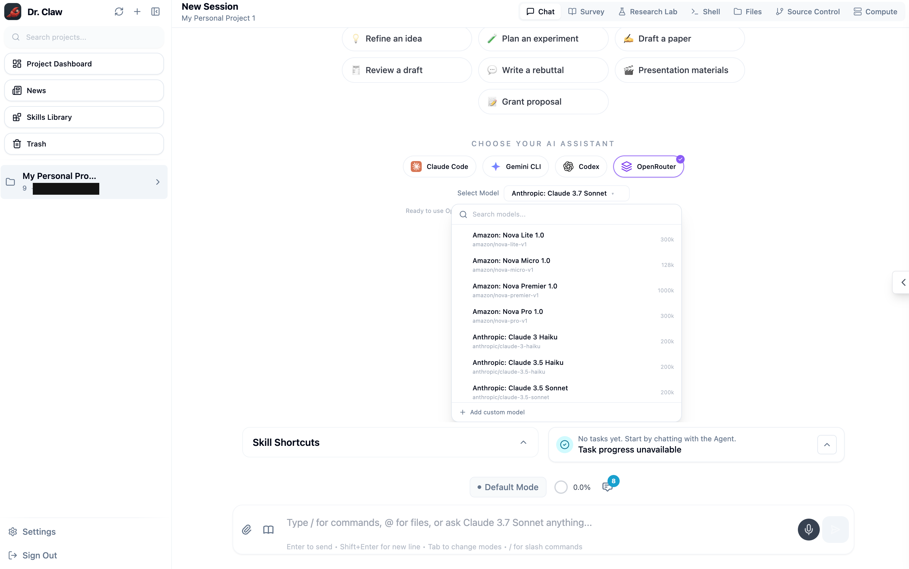
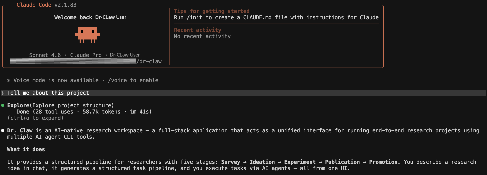

<div align="center">
  
  <h1>Dr. Claw: Your AI Research Assistant</h1>
  <p><strong>Full-stack research workspace.</strong></p>
</div>

<p align="center">
<a href="https://openlair.github.io/dr-claw">

</a>
<a href="https://github.com/OpenLAIR/dr-claw">

</a>
<a href="https://github.com/OpenLAIR/dr-claw/blob/main/LICENSE">

</a>
<a href="https://join.slack.com/t/vibe-lab-group/shared_invite/zt-3r4bkcx5t-iGyRMI~r09zt7p_ND2eP9A">

</a>
<a href="https://x.com/Vibe2038004">

</a>
<a href="./public/wechat-group-qr.jpg">

</a>
</p>

<p align="center">
  <a href="./README.md">English</a> | <a href="./README.zh-CN.md">中文</a>
</p>

## Table of Contents

- [Overview](#overview)
- [Highlights](#highlights)
- [Quick Start](#quick-start)
- [Configuration](#configuration)
- [OpenRouter](#openrouter)
- [OpenClaw Integration](#openclaw-integration)
- [Research Lab - Quick Example](#research-lab-quick-example)
- [Usage Guide](#usage-guide)
- [Additional Details](#additional-details)
- [Contributing](#contributing)
- [FAQ](./docs/faq.md)
- [License](#license)
- [Citation](#citation)
- [Acknowledgments](#acknowledgments)
- [Support & Community](#support--community)

## Overview

Dr. Claw is a general-purpose AI research assistant designed to help researchers and builders execute end-to-end projects across different domains. From shaping an initial idea to running experiments and preparing publication-ready outputs, Dr. Claw keeps the full workflow in one place so teams can focus on research quality and iteration speed.

## Product Screenshot

<p align="center">
  
</p>

<details>
<summary><strong>The Philosophy: Leveraged Cognition</strong></summary>

<p align="center">
  
</p>

**Manual work is too slow. Fully automated AI is too generic. Vibe Researching is the new frontier.** Dr. Claw turns your **Research Taste** into outsized outcomes with **Agentic Execution**--so you can move faster, think bigger, and still hold the line on scientific rigor.

</details>

## Highlights

- **🔬 Research Lab** — Structured dashboard for end-to-end research: define your brief, generate a pipeline of tasks, track progress across Survey → Ideation → Experiment → Publication → Promotion, and inspect source papers, ideas (rendered with LaTeX math), and cache artifacts — all at a glance
- **⚡ Auto Research** — Start one-click sequential task execution directly from the Project Dashboard, open the generated session live, and receive an email when the run completes
- **📚 100+ Research Skills** — A curated library spanning idea generation, code survey, experiment development & analysis, paper writing, review response, and delivery — automatically discovered by agents and applied as task-level assistance
- **🗂️ Chat-Driven Pipeline** — Describe your research idea in Chat; the agent uses the `inno-pipeline-planner` skill to interactively generate a structured research brief and task list — no manual templates needed
- **🤖 Multi-Agent Backend** — Seamlessly switch between Claude Code, Gemini CLI, Codex, and OpenRouter as your execution engines

### What the Pipeline Produces

| | Artifact | Location | Description |
|---|---|---|---|
| 📚 | Survey reports | `Survey/reports/` | Literature reviews with citations from arXiv, Semantic Scholar, and web sources |
| 💡 | Research ideas | `Ideation/ideas/` | Brainstorming outputs with multi-persona evaluation scores |
| 🔬 | Experiment code | `Experiment/core_code/` | Implementation from the plan → implement → judge loop |
| 📊 | Analysis results | `Experiment/analysis/` | Statistical analysis, tables, and paper-ready figures |
| 📝 | Paper draft | `Publication/paper/` | Academic manuscript (IEEE/ACM format) with citations and LaTeX math |
| 🎞️ | Presentation | `Promotion/slides/` | Slide deck, TTS narration audio, and demo video |

> See [docs/pipeline-outputs.md](docs/pipeline-outputs.md) for the full artifact list and project directory structure.

<details>
<summary><span style="font-size: 1.17em; font-weight: 600;">More Features</span></summary>

- **💬 Interactive Chat + Shell** — Chat with your agent or drop into a full terminal — side by side with your research context
- **📁 File & Git Explorer** — Browse files with syntax highlighting, live-edit, stage changes, commit, and switch branches without leaving the UI
- **📱 Responsive & PWA-Ready** — Desktop, tablet, and mobile layouts with bottom tab bar, swipe gestures, and Add-to-Home-Screen support
- **🔄 Session Management** — Resume conversations, manage multiple sessions, and track full history across projects

</details>

### Feature Gallery

<details>
<summary><strong>Expand screenshots</strong></summary>

<p><strong>Project Dashboard</strong> — Start from the project overview, review status, and launch end-to-end automation.</p>
<p align="center">
  
</p>

<p><strong>Skill Library</strong> — Browse reusable research skills across ideation, experimentation, and writing.</p>
<p align="center">
  
</p>

<p><strong>News Dashboard</strong> — Follow research-relevant updates without leaving the workspace.</p>
<p align="center">
  
</p>

</details>


## Quick Start

### Prerequisites

- [Node.js](https://nodejs.org/) v20 or higher (**v22 LTS recommended**, see `.nvmrc`)
- At least one of the following CLI tools installed and configured:
  - [Claude Code CLI](https://docs.anthropic.com/en/docs/claude-code)
  - [Gemini CLI](https://geminicli.com/docs/get-started/installation/)
  - [Codex CLI](https://developers.openai.com/codex/cli/)
- Some systems need native build tools for dependencies like `node-pty` and `better-sqlite3`. If `npm install` fails, see [FAQ](docs/faq.md).

Cursor agent support is in progress and coming soon.

### Installation 

1. **Clone the repository:**
```bash
git clone https://github.com/OpenLAIR/dr-claw.git
cd dr-claw
```

2. **Install dependencies:**
```bash
npm install
```

3. **Configure environment:**
```bash
cp .env.example .env
# Edit .env with your preferred settings (port, etc.)
```

Need custom ports, auth, or workspace settings? See [docs/configuration.md](docs/configuration.md).

4. **Start the application:**

```bash
# Development mode (with hot reload)
npm run dev
```

Then create your account via the bowser `http://localhost:5173`.

5. **Use the application**

There are two ways to interact with Dr. Claw: the **frontend UI** workflow or the **terminal-only**. The UI provides richer visualization but may encounter occasional bugs; the terminal approach is more stable and lightweight.

#### Option A: Frontend UI

Open your browser at `http://localhost:5173` (or the port you configured in `.env`).


#### Option B: Terminal Only

<p align="center">
  
</p>

Open a **second terminal** (keep `npm run dev` running in the first) and install the `drclaw` CLI harness:

```bash
pip install -e ./agent-harness
```

Then log in with the credentials you created during setup:

```bash
drclaw auth login --username YOUR_USERNAME --password YOUR_PASSWORD
```

Install at least one agent CLI (if you haven't already):

| Agent | Install | Auth |
|-------|---------|------|
| Claude Code | `npm install -g @anthropic-ai/claude-code` | `claude` → follow OAuth prompt |
| Gemini CLI | `npm install -g @google/gemini-cli` | `gemini` → Google sign-in, or `export GOOGLE_API_KEY=...` |
| Codex CLI | `npm install -g @openai/codex` | `codex login`, or `export OPENAI_API_KEY=...` |
| **OpenRouter** | No CLI needed | `export OPENROUTER_API_KEY=sk-or-...` (get a key at [openrouter.ai/keys](https://openrouter.ai/keys)) |

> **OpenRouter** lets you use *any* model (GPT-5, Claude, Gemini, DeepSeek, Llama, Mistral, Qwen, etc.) through a single API key. Select your model in the UI or set `OPENROUTER_MODEL` in `.env`.

Navigate to the project directory you want to work in and launch any of the agents:

```bash
cd /path/to/your/project
claude    # or: gemini | codex
```

Skills from `dr-claw/skills/` are automatically symlinked into each project's `.claude/skills/` directory when the project is created, so the agent discovers them without extra configuration. You can also reference any skill manually inside a session:

```
> Read .claude/skills/inno-experiment-analysis/SKILL.md and follow it to analyze my results.
```


#### Option C: OpenRouter Terminal Chat

For a lightweight terminal-only experience using any [OpenRouter](https://openrouter.ai/) model, use the built-in `dr-claw chat` command. No browser or UI required — just an interactive agentic session with full tool-calling capabilities (file I/O, shell, grep, glob, web search/fetch).

```bash
# Make sure OPENROUTER_API_KEY is set (or pass --key)
export OPENROUTER_API_KEY=sk-or-...

# Launch a chat session with any model
node server/cli.js chat --model moonshotai/kimi-k2.5
```

You can also pass the API key inline:

```bash
node server/cli.js chat --model anthropic/claude-sonnet-4 --key sk-or-your-key
```

| Flag | Description |
|------|-------------|
| `--model <slug>` | OpenRouter model slug (e.g., `moonshotai/kimi-k2.5`, `anthropic/claude-sonnet-4`, `deepseek/deepseek-r1`) |
| `--key <key>` | OpenRouter API key (defaults to `OPENROUTER_API_KEY` env var) |

Browse all available models at [openrouter.ai/models](https://openrouter.ai/models).


If agent web search does not work later, see [Troubleshooting Web Search](#troubleshooting-web-search) below.

## OpenClaw Integration
<details>
<summary><span style="font-size: 1.17em; font-weight: 600;">Turn Dr. Claw into a mobile-ready, voice-friendly research secretary</span></summary>

> OpenClaw connects to Dr. Claw through the `drclaw` CLI, giving you project control, smart digests, and proactive notifications — all from your phone or chat app.

### Architecture

```
┌─────────────────────────────────────────────────────────────┐
│  User  (mobile / chat / voice)                              │
│    ↕                                                        │
│  OpenClaw  ── secretary layer ──────────────────────────┐   │
│    │  runs local `drclaw ...`       receives push msgs  │   │
│    ↓                                        ↑           │   │
│  drclaw CLI  ── stable control plane ──────────────┐    │   │
│    │  JSON + openclaw.* schema          WebSocket   │    │   │
│    ↓                                        │       │    │   │
│  Dr. Claw Server                        Watcher ────┘    │   │
│    (projects, sessions, pipelines, artifacts)            │   │
└─────────────────────────────────────────────────────────────┘
```

The integration has three layers:

| Layer | What it does |
|-------|-------------|
| **Control plane** | OpenClaw executes `drclaw --json ...` commands locally |
| **Structured contract** | JSON responses carry a versioned `openclaw.*` schema payload |
| **Proactive delivery** | An event-driven watcher pushes important changes to Feishu / Lark |

---

### Quick Start (6 steps)

<details>
<summary><strong>Prerequisites</strong></summary>

- Dr. Claw server running locally (`npm run dev` or `drclaw server on`)
- At least one project and one execution backend (Claude Code, Gemini CLI, or Codex)
- OpenClaw with local shell / `exec` capability
- *(Optional)* Feishu / Lark channel access for push notifications

</details>

**1. Start the server**

```bash
npm install && npm run dev       # or: drclaw server on
drclaw --json auth status        # verify reachability
```

> `drclaw server status` only reports the daemon from `drclaw server on`. If you started Dr. Claw with `npm run dev`, it may show `STOPPED` even though `http://localhost:3001` is working — use `auth status` as the real check.

**2. Install the CLI**

```bash
pip install -e ./agent-harness
drclaw --help
```

If `drclaw` is not on your PATH:

```bash
PYTHONPATH=agent-harness python3 -m cli_anything.drclaw.drclaw_cli --help
```

**3. Authenticate**

```bash
drclaw auth login --username <user> --password <pass>
drclaw --json projects list      # should return your projects
```

**4. Link OpenClaw**

```bash
drclaw install --server-url http://localhost:3001
# with push channel:
drclaw install --server-url http://localhost:3001 --push-channel feishu:<chat_id>
```

This copies the Dr. Claw skill, installs wrapper scripts, and saves the server URL and CLI path.

**5. Verify the core loop**

Run these four commands from OpenClaw — if they all return valid JSON, the integration is live:

```bash
drclaw --json projects list                            # resolve projects
drclaw --json chat waiting                             # find sessions needing input
drclaw --json digest portfolio                         # cross-project summary
drclaw --json workflow status --project <project>      # single-project status
```

**6. Reply into a session**

```bash
drclaw --json chat waiting                             # pick a session
drclaw --json chat reply --project <proj> --session <sid> -m “Continue with option B.”
drclaw --json chat waiting --project <proj>            # confirm it cleared
```

For multi-turn discussion within the same project:

```bash
drclaw --json chat project --project <proj> --session <sid> -m “Summarize blockers.”
```

---

### Structured Schema

Machine-facing commands return a versioned `openclaw` field. Current families:

| Schema | Purpose |
|--------|---------|
| `openclaw.turn.v1` | Single chat turn summary |
| `openclaw.project.v1` | Project digest with status, counts, and next actions |
| `openclaw.portfolio.v1` | Cross-project overview with recommendations |
| `openclaw.daily.v1` | Daily digest |
| `openclaw.report.v1` | Mobile-ready report payload |
| `openclaw.event.v1` | Watcher event with derived signals |

**Client rendering tips:**

| When you need to... | Read this field |
|----------------------|-----------------|
| Decide whether to interrupt the user | `openclaw.decision.needed` |
| Show quick actions or voice suggestions | `openclaw.next_actions` |
| Render a compact summary | `openclaw.turn.summary` or `openclaw.focus` |
| Handle watcher notifications | `openclaw.event.v1.event.signals` |

> Always prefer the `openclaw` payload over raw `reply` text when both are present.

Full contract: [`agent-harness/cli_anything/drclaw/SCHEMA.md`](agent-harness/cli_anything/drclaw/SCHEMA.md)

---

### Proactive Watcher

The watcher is event-driven — it subscribes to Dr. Claw WebSocket events and only notifies on attention-worthy changes.

```bash
# Configure push channel
drclaw openclaw configure --push-channel feishu:<chat_id>

# Manage the watcher
drclaw --json openclaw-watch on --to feishu:<chat_id>
drclaw --json openclaw-watch status
drclaw --json openclaw-watch off
```

**How it works:**

```
WebSocket event → project resolution → snapshot diff → signal derivation
                                                          ↓
                         dedup (6h TTL) ← stable signature + signal kinds
                                                          ↓
                         openclaw agent --deliver → Feishu / Lark summary
                                (fallback: plain bridge push)
```

**Derived signals:**

| Signal | Meaning |
|--------|---------|
| `human_decision_needed` | Agent requests permission for a tool call |
| `waiting_for_human` | Session is blocked on user input |
| `blocker_detected` | A task transitioned to blocked state |
| `blocker_cleared` | A previously blocked task is now unblocked |
| `task_completed` | One or more tasks finished |
| `next_task_changed` | The recommended next task has changed |
| `attention_needed` | General attention signal |
| `session_aborted` | A session execution was aborted |

State and logs:
- `~/.drclaw/openclaw-watcher-state.json`
- `~/.drclaw/logs/openclaw-watcher.log`

---

### Serialized Local Turns

When OpenClaw calls `openclaw agent --local` repeatedly, use the wrapper script to avoid session-lock collisions:

```bash
agent-harness/skills/dr-claw/scripts/openclaw_drclaw_turn.sh \
  --json -m “Use your exec tool to run \`drclaw --json digest portfolio\`. Return only raw stdout.”
```

> **Rule of thumb:** stable serial turns are always better than risky parallel turns.

---

### Integration Checklist

Your OpenClaw integration is complete when all of these work:

- [ ] OpenClaw can list Dr. Claw projects
- [ ] OpenClaw can identify waiting sessions
- [ ] OpenClaw can reply into a chosen session
- [ ] OpenClaw can produce a `digest portfolio` summary
- [ ] OpenClaw receives at least one watcher-driven push in Feishu / Lark

At that point, OpenClaw becomes Dr. Claw's mobile secretary. Users can speak naturally:

> *”Which projects are waiting for my reply?”*
> *”Summarize this project's progress and blockers.”*
> *”Reply to that session: go with option B and report back.”*
> *”Give me a cross-project summary and what to focus on today.”*
> *”I have a new idea — create a project, discuss it with me, and start planning.”*

</details>

## Configuration

Dr. Claw reads local settings from `.env`. For most users, the only required step is copying `.env.example` to `.env`, but these are the settings you are most likely to adjust early:

- `PORT`: backend server port
- `VITE_PORT`: frontend dev server port
- `HOST`: bind address for the frontend and backend
- `JWT_SECRET`: required before exposing Dr. Claw beyond localhost
- `WORKSPACES_ROOT`: default root for new project workspaces

For the full environment reference and deployment notes, see [docs/configuration.md](docs/configuration.md).

Auto Research email notifications are configured inside the app at **Settings → Email**. The v1 flow supports Claude Code, Codex, Gemini, and OpenRouter engines for unattended task execution, and interrupted runs are automatically reconciled so they do not remain stuck in `running`.

## OpenRouter

[OpenRouter](https://openrouter.ai/) is integrated as a first-class provider, giving you access to **hundreds of models** (GPT-5, Claude, Gemini, DeepSeek, Llama, Mistral, Qwen, Kimi, and more) through a single API key.

### Setup

1. Get an API key at [openrouter.ai/keys](https://openrouter.ai/keys).
2. Set the key in one of three ways:
   - **Environment variable:** `export OPENROUTER_API_KEY=sk-or-...`
   - **`.env` file:** add `OPENROUTER_API_KEY=sk-or-...` to your project `.env`
   - **UI:** go to **Settings → OpenRouter** and paste your key

### Using OpenRouter in the UI

1. Open a project and go to **Chat**.
2. Under **Choose Your AI Assistant**, click **OpenRouter**.
3. Search for a model in the dropdown (it fetches the full list from OpenRouter) or type a custom model slug.
4. Start chatting — the agent has the same tool-calling capabilities as Claude, Gemini, and Codex (file read/write, shell, grep, glob, web search/fetch, todo).

OpenRouter is also available in **Auto Research** on the Project Dashboard — select it as the provider and pick any model.

### Using OpenRouter in the Terminal

No browser needed. The `dr-claw chat` CLI gives you a fully agentic terminal session:

```bash
# Basic usage
node server/cli.js chat --model moonshotai/kimi-k2.5

# With an explicit API key
node server/cli.js chat --model deepseek/deepseek-r1 --key sk-or-your-key
```

The CLI supports the same tools as the UI (file I/O, shell, grep, glob, web search, web fetch, todo). Type your message and the agent will execute multi-step research tasks autonomously.

### Default Model

Set `OPENROUTER_MODEL` in `.env` to change the default model used when none is specified:

```env
OPENROUTER_MODEL=moonshotai/kimi-k2.5
```

If unset, the default is `anthropic/claude-sonnet-4`.

<a id="research-lab-quick-example"></a>

## Research Lab — Quick Example

The core feature of Dr. Claw is the **Research Lab**.

<details>
<summary><strong>Research Lab Screenshot</strong></summary>

<p align="center">
  
</p>

</details>

The typical flow is:

1. Configure one supported agent in **Settings**.
2. Configure notification settings in **Settings → Email** if you want completion email notifications.
3. Describe your research idea in **Chat**.
4. Let the agent generate `.pipeline/docs/research_brief.json` and `.pipeline/tasks/tasks.json`.
5. Review the pipeline in **Research Lab** and either send tasks back to **Chat** manually or click **Auto Research** on the Project Dashboard to run them sequentially.

For full step-by-step operations, see **Usage Guide** below.

## Usage Guide

After starting Dr. Claw, open your browser and follow the steps below.

<details>
<summary><strong>Step 1 — Create or Open a Project</strong></summary>

When you first open Dr. Claw you will see the **Projects** sidebar. You have two options:

- **Open an existing project** — Dr. Claw auto-discovers registered projects and linked sessions from Claude Code, Codex, and Gemini.
- **Create a new project** — Click the **"+"** button, choose a directory on your machine, and Dr. Claw will set up the workspace: agent folders such as `.claude/`, `.agents/`, `.gemini/`, standard workspace metadata, linked `skills/` directories, preset research dirs (`Survey/references`, `Survey/reports`, `Ideation/ideas`, `Ideation/references`, `Experiment/code_references`, `Experiment/datasets`, `Experiment/core_code`, `Experiment/analysis`, `Publication/paper`, `Promotion/homepage`, `Promotion/slides`, `Promotion/audio`, `Promotion/video`), and **instance.json** at the project root with absolute paths for those directories. Cursor agent support is coming soon.

> **Default project storage path:** New projects are stored under `~/dr-claw` by default. You can change this in **Settings → Appearance → Default Project Path**, or set the `WORKSPACES_ROOT` environment variable. The setting is persisted in `~/.claude/project-config.json`.

</details>

<details>
<summary><strong>Step 2 — Generate Your Research Pipeline via Chat</strong></summary>

After creating or opening a project, Dr. Claw opens **Chat** by default. If no research pipeline exists yet, an onboarding banner appears with a **Use in Chat** button that injects a starter prompt.

<details>
<summary><strong>Chat Screenshot</strong></summary>

<p align="center">
  
</p>

</details>

Describe your research idea — even a rough one is fine. The agent uses the `inno-pipeline-planner` skill to ask clarifying questions and then generates:
- `.pipeline/docs/research_brief.json` (your structured research brief)
- `.pipeline/tasks/tasks.json` (the task pipeline)

</details>

<details>
<summary><strong>Step 3 — Review in Research Lab and Execute Tasks</strong></summary>

Switch to **Research Lab** to review the generated tasks, progress metrics, and artifacts. Then execute tasks:

<details>
<summary><strong>Task Execution Screenshot</strong></summary>

<p align="center">
  
</p>

</details>

1. Choose a CLI backend from the **CLI selector** (Claude Code, Gemini CLI, or Codex).
2. In **Research Lab**, click **Go to Chat** or **Use in Chat** on a pending task.
3. The agent executes the task and writes results back to the project.

</details>

<details>
<summary><strong>Optional — Run Auto Research from the Project Dashboard</strong></summary>

If you want Dr. Claw to execute the generated task list end-to-end for you, use **Auto Research**:
1. Open **Settings → Email** and configure `Notification Email`, `Sender Email`, and `Resend API Key`.
2. Make sure your project already contains `.pipeline/docs/research_brief.json` and `.pipeline/tasks/tasks.json`.
3. Open the **Project Dashboard** and click **Auto Research** on the project card.
4. Use **Open Session** to jump into the live Claude session created for the run.
5. When all tasks finish, Dr. Claw sends a completion email. If the session is interrupted, stale runs are recovered automatically so they can be cancelled cleanly instead of staying stuck in `running`.

</details>

<a id="troubleshooting-web-search"></a>
<details>
<summary><strong>Step 4 — Troubleshooting Web Search</strong></summary>

If the agent cannot search webpages, your current permission settings are likely too restrictive. Also check whether a runtime network lock is still active for the process.

1. Check the runtime network lock:
```bash
echo "${CODEX_SANDBOX_NETWORK_DISABLED:-0}"
```

If the output is `1`, network requests can remain blocked even if Settings permissions are opened. Remove or override this variable in your deployment or startup layer (shell profile, systemd, Docker, PM2), then restart Dr. Claw.

2. Open **Settings** (gear icon in sidebar).
3. Go to **Permissions**, then choose your current agent:
- **Claude Code**:
  - Enable `WebSearch` and `WebFetch` in **Allowed Tools**.
  - Ensure they are not present in **Blocked Tools**.
  - Optionally enable **Skip permission prompts** if you want fewer confirmations.
- **Gemini CLI**:
  - Choose an appropriate **Permission Mode**.
  - Allow `google_web_search` and `web_fetch` in **Allowed Tools** when web access is required.
  - Ensure they are not present in **Blocked Tools**.
- **Codex**:
  - In **Permission Mode**, switch to **Bypass Permissions** when web access is required.
4. Return to **Chat**, start a new message, and retry your web-search prompt.

Codex permission mode notes:
- **Default / Accept Edits**: sandboxed execution; network may still be restricted by session policy.
- **Bypass Permissions**: `sandboxMode=danger-full-access` with full disk and network access.

Security note:
- Use permissive settings only in trusted projects/environments.
- After finishing web search tasks, switch back to safer settings.

</details>

<details>
<summary><strong>Step 5 — Resolve "Workspace Trust" or First-Run Errors</strong></summary>

Each agent may require a one-time trust confirmation before it can execute code in your project directory. If Chat freezes or shows a trust prompt, switch to the **Shell** tab inside Dr. Claw and approve the prompt there.

Steps:
1. Switch to the **Shell** tab in Dr. Claw.
2. Approve the trust/auth prompt shown in Shell.
3. Return to **Chat** and resend your message.

By default, trust flow is already enabled in Dr. Claw, so you usually do **not** need to manually run extra trust commands.

The trust decision is persisted per directory — you only need to do this once per project.

> **Shell tab not working?** If the Shell tab shows `Error: posix_spawnp failed`, see [docs/faq.md](docs/faq.md) for the fix, then retry.

You can switch tabs at any time:

| Tab | What it does |
|-----|-------------|
| **Chat** | Start here. Use it to describe your research idea, generate a pipeline, and run tasks with the selected agent. |
| **Survey** | Review papers, literature graphs, notes, and survey-stage tasks for the current project. |
| **Research Lab** | Review the research brief, task list, progress, and generated artifacts in one place. |
| **Skills** | Browse installed skills, inspect their contents, and import additional local skills. |
| **Compute** | Manage compute resources and run experiment workloads from one place. |
| **Shell** | Use the embedded terminal when you need direct CLI access, trust prompts, or manual commands. |
| **Files** | Browse, open, create, rename, and edit project files with syntax highlighting. |
| **Git** | Inspect diffs, stage changes, commit, and switch branches without leaving the app. |

</details>

<details>
<summary><strong>Research Skills</strong></summary>

Dr. Claw now uses the generated **Pipeline Task List** as the execution flow.
The project includes **100+ skills** under `skills/` to support research tasks (idea exploration, code survey, experiment development/analysis, writing, review, and delivery).
These skills are discovered by the agent and can be applied as task-level assistance throughout the workflow.

</details>

## Additional Details
<details>
<summary><span style="font-size: 1.17em; font-weight: 600;">Mobile, architecture, and security notes</span></summary>

### Mobile & Tablet

Dr. Claw is fully responsive. On mobile devices:

- **Bottom tab bar** for thumb-friendly navigation
- **Swipe gestures** and touch-optimized controls
- **Add to Home Screen** to use it as a PWA (Progressive Web App)

### Architecture

#### System Overview

```
┌─────────────────┐    ┌─────────────────┐    ┌─────────────────┐
│   Frontend      │    │   Backend       │    │  Agent          │
│   (React/Vite)  │◄──►│ (Express/WS)    │◄──►│  Integration    │
│                 │    │                 │    │                │
└─────────────────┘    └─────────────────┘    └─────────────────┘
```

#### Backend (Node.js + Express)
- **Express Server** - RESTful API with static file serving
- **WebSocket Server** - Communication for chats and project refresh
- **Agent Integration (Claude Code, Gemini CLI, Codex, OpenRouter)** - Process spawning, streaming, and session management
- **File System API** - Exposing file browser for projects

#### Frontend (React + Vite)
- **React 18** - Modern component architecture with hooks
- **CodeMirror** - Advanced code editor with syntax highlighting

### Security & Tools Configuration

**🔒 Important Notice**: Agent permissions are configurable per provider. Review **Settings → Permissions** before enabling broad file, shell, or web access.

#### Enabling Tools

To use web and tool-heavy workflows safely:

1. **Open Settings** - Click the gear icon in the sidebar
2. **Choose an Agent** - Claude Code, Gemini CLI, or Codex
3. **Enable Selectively** - Turn on only the tools or permission mode you need
4. **Apply Settings** - Your preferences are saved locally

**Recommended approach**: Start with the safest permission mode that still lets you complete the task, then relax settings only when needed.

</details>

## Contributing
<details>
<summary><span style="font-size: 1.17em; font-weight: 600;">Show details</span></summary>

We welcome contributions! Please follow these guidelines:

#### Getting Started
1. **Fork** the repository
2. **Clone** your fork: `git clone <your-fork-url>`
3. **Install** dependencies: `npm install`
4. **Create** a feature branch: `git checkout -b feature/amazing-feature`

#### Development Process
1. **Make your changes** following the existing code style
2. **Test thoroughly** - ensure all features work correctly
3. **Run quality checks**: `npm run typecheck && npm run build`
4. **Commit** with descriptive messages following [Conventional Commits](https://conventionalcommits.org/)
5. **Push** to your branch: `git push origin feature/amazing-feature`
6. **Submit** a Pull Request with:
   - Clear description of changes
   - Screenshots for UI changes
   - Test results if applicable

#### What to Contribute
- **Bug fixes** - Help us improve stability
- **New features** - Enhance functionality (discuss in issues first)
- **Documentation** - Improve guides and API docs
- **UI/UX improvements** - Better user experience
- **Performance optimizations** - Make it faster

</details>

For setup help and troubleshooting, see [FAQ](docs/faq.md).

## Legacy Compatibility & Deprecation

Dr. Claw was previously known as **VibeLab**. For users migrating from VibeLab, we provide a compatibility layer during the transition phase:

- **CLI Alias**: The `vibelab` command is still supported as an alias for `drclaw` but will issue a deprecation warning.
- **Python Package**: The `VibeLab` class in the `agent-harness` is deprecated; please use the `DrClaw` class instead.
- **Session Files**: The CLI now defaults to `~/.drclaw_session.json` but will automatically check for and migrate `~/.vibelab_session.json` if found.
- **Environment Variables**: `DRCLAW_URL` and `DRCLAW_TOKEN` are preferred, but `VIBELAB_URL` and `VIBELAB_TOKEN` are still supported as fallbacks.

**Timeline**: We plan to remove legacy `vibelab` support in Version 2.0 (estimated Q3 2026). Please update your scripts and integrations as soon as possible.

## License

This repository contains a combined work.

Upstream portions derived from Claude Code UI remain under GNU General Public License v3.0 (GPL-3.0), while original modifications and additions by Dr. Claw Contributors are licensed under GNU Affero General Public License v3.0 (AGPL-3.0).

See [LICENSE](LICENSE) and [NOTICE](NOTICE) for the full license texts and scope details.

## Citation

If you find Dr. Claw useful in your research, please cite:

```bibtex
@misc{song2026drclaw,
  author       = {Dingjie Song and Hanrong Zhang and Dawei Liu and Yixin Liu and Zongxia Li and Zhengqing Yuan and Siqi Zhang and Lichao Sun},
  title        = {Dr. Claw: An AI Research Workspace from Idea to Paper},
  year         = {2026},
  organization = {GitHub},
  url          = {https://github.com/OpenLAIR/dr-claw},
  homepage     = {https://openlair.github.io/dr-claw},
}
```

## Acknowledgments

### Built With
- **[Claude Code](https://docs.anthropic.com/en/docs/claude-code)** - Anthropic's official CLI
- **[Gemini CLI](https://geminicli.com/docs/get-started/installation/)** - Google's Gemini command-line agent
- **[Codex](https://developers.openai.com/codex)** - OpenAI Codex
- **[React](https://react.dev/)** - User interface library
- **[Vite](https://vitejs.dev/)** - Fast build tool and dev server
- **[Tailwind CSS](https://tailwindcss.com/)** - Utility-first CSS framework
- **[CodeMirror](https://codemirror.net/)** - Advanced code editor

### Also Thanks To
- **[Claude Code UI](https://github.com/siteboon/claudecodeui)** — Dr. Claw is based on it. See [NOTICE](NOTICE) for details.
- **[AI Researcher](https://github.com/HKUDS/AI-Researcher/)** (HKUDS) — Inspiration for research workflow and agentic research.
- **[Vibe-Scholar](https://github.com/Mr-Tieguigui/Vibe-Scholar)** — Inspiration for the AI-native research workspace direction.
- **[autoresearch](https://github.com/karpathy/autoresearch)** — Inspiration for autonomous research orchestration and end-to-end execution.

## Support & Community

### Stay Updated
- **Star** this repository to show support
- **Watch** for updates and new releases
- **Follow** the project for announcements

---

<div align="center">
  <strong>Dr. Claw — From idea to paper.</strong>
</div>
